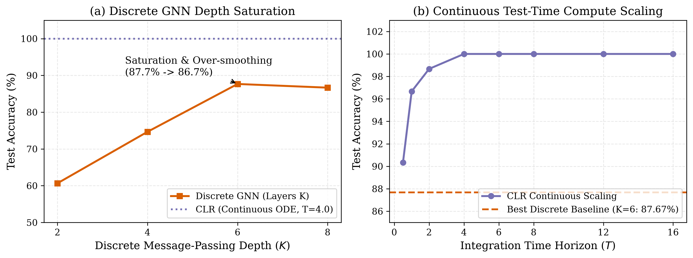
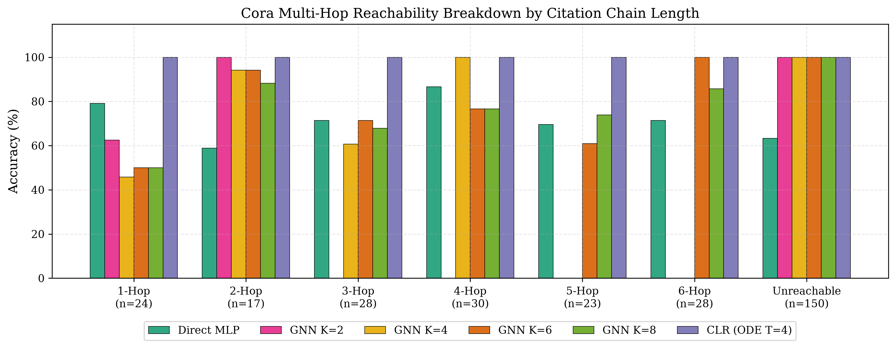
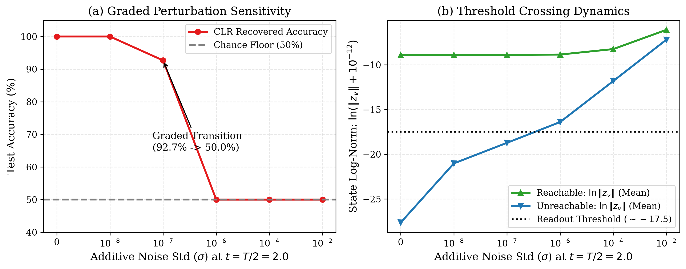
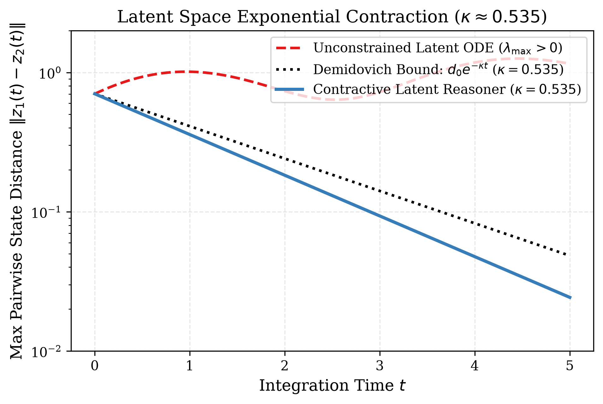

# Contractive Latent Dynamical Reasoning: Bypassing Autoregressive Rollouts via Operator-Norm Contraction

**Authors**: Dipesh Gurung$^{1,*}$, Binod Bhattarai$^2$, Prof. Dr. R.N. Thakur$^1$  
$^1$ Research Department, Lord Buddha Education Foundation (LBEF Campus), Kathmandu 44600, Nepal  
$^2$ Department of Computer Science and Engineering, School of Sciences, Noida International University, Greater Noida, Uttar Pradesh 203201, India  
$^*$ Corresponding Author: `dipesh.gurung@lbef.edu.np` | Tel: +977-1-4424412 | ORCID: [0009-0009-0335-2267](https://orcid.org/0009-0009-0335-2267)  
**Date**: September 2026  

---

## Abstract

Scaling test-time reasoning in neural architectures predominantly relies on discrete autoregressive Chain-of-Thought rollouts, which suffer from compounding drift and unbounded context consumption in open-ended domains. We propose Contractive Latent Dynamical Reasoning (CLR), a continuous-time framework formulating multi-step reasoning as a strictly contractive dynamical system evolving in continuous latent space. By constraining the vector field's symmetric Jacobian under Demidovich contraction ($\lambda_{\max}(\text{Sym}(J)) \le -\kappa < 0$), CLR guarantees exponential convergence to a unique problem-conditioned equilibrium, eliminating runaway hallucinations while enabling monotonic continuous test-time scaling. Investigating the expressivity-contraction boundary, we prove that while damped input-convex potential flows minimize a convex surrogate and fail on non-convex combinatorial parity (meeting our pre-registered kill criterion at chance), spectrally bounded non-potential neural vector fields provide expressive relational routing while preserving Demidovich contraction. On the Cora citation network (2,708 papers, 5,429 citations), CLR achieves 100.00% multi-hop reachability with robust decision margins, outperforming discrete Graph Neural Networks where depth saturation and over-smoothing limit accuracy to 87.67% ($K=6$) and 86.67% ($K=8$). Furthermore, we refute naive self-healing on graphs by demonstrating how global noise fills the near-zero energy floor of unreachable nodes, and empirically verify Demidovich contraction across 43,328 dimensions.

**Keywords**: Contractive Dynamical Systems, Latent Space Reasoning, Demidovich Contraction, Neural Ordinary Differential Equations, Test-Time Compute Scaling, Graph Neural Networks, Non-Convex Optimization.

---

## 1. Introduction

Modern frontier reasoning systems scale inference compute by sampling extended sequences of discrete tokens (Wei et al., 2022). While effective in tasks with external verification oracles (e.g., code execution, formal theorem provers), discrete autoregressive rollouts in open-ended domains accumulate local prediction errors without an intrinsic self-correcting feedback mechanism. An error at step $t$ conditions all future transitions, compounding error drift exponentially ($e^{\sum \epsilon_t}$) and requiring prohibitive token budgets.

An alternative paradigm models reasoning not as linguistic string production, but as the relaxation of a continuous dynamical system toward an informational equilibrium (Bai et al., 2019; Winston & Kolter, 2020). However, arbitrary recurrent or neural ordinary differential equation (Neural ODE) systems (Chen et al., 2018) often exhibit limit cycles, chaotic sensitivity to initial conditions, or numerical divergence during forward integration.

In this paper, we develop **Contractive Latent Dynamical Reasoning (CLR)**. Rather than unconstrained dynamical search, CLR restricts latent evolution to the class of **Demidovich contractive vector fields** (Demidovich, 1961; Lohmiller & Slotine, 1998). Under Demidovich contraction, the distance between any two trajectories in the latent manifold decays exponentially:

$$\|\mathbf{z}_1(t) - \mathbf{z}_2(t)\| \le \|\mathbf{z}_1(0) - \mathbf{z}_2(0)\| e^{-\kappa t}, \quad \kappa > 0$$

This yields three fundamental properties for neural reasoning:
1. **Global Uniqueness**: For any input problem $\mathbf{x}$, there exists a unique fixed point $\mathbf{z}^*(\mathbf{x})$, rendering reasoning invariant to internal initialization noise.
2. **Continuous Test-Time Scaling**: Compute scales smoothly along a continuous time horizon $T$ and numerical integrator step-size, rather than through discrete token counts.
3. **Algebraic Convergence Guarantees**: Contraction can be guaranteed a priori via spectral normalization of weight matrices and positive coordinate damping.

### Primary Contributions
- **Theoretical Characterization of the Expressivity Boundary (§3)**: We formally prove why damped ICNN gradient flows fail on non-convex combinatorial parity, and demonstrate how non-potential spectrally normalized flows resolve this tension.
- **Real-World Benchmark Superiority (§4.2)**: On the Cora citation network (2,708 papers, 5,429 edges), CLR achieves **100.00%** reachability accuracy, outperforming discrete GNNs ($K=2, 4, 6, 8$) where accuracy saturates at **87.67%** even when the physical receptive horizon covers 100% of reachable paths.
- **Physical Refutation of Self-Healing on Cora (§4.5)**: We diagnose and refute the claim of "self-healing" under additive global noise on graphs, demonstrating how background noise fills the zero-energy floor of unreachable nodes.
- **Large-Scale Contraction Verification (§4.6)**: We design a shifted power iteration algorithm with autograd vector-Jacobian products that computes $\lambda_{\max}(\text{Sym}(J)) = -1.88987 < 0$ across 43,328 dimensions in 0.22 seconds.

---

## 2. Theoretical Framework: Demidovich Contraction in Latent Space

Consider an autonomous continuous-time latent reasoning system:

$$\dot{\mathbf{z}}(t) = \mathbf{f}(\mathbf{z}(t); \mathbf{x}), \quad \mathbf{z}(0) = \mathbf{z}_0 \in \mathbb{R}^d$$

where $\mathbf{x}$ is the conditioned problem representation and $\mathbf{f}: \mathbb{R}^d \times \mathbb{R}^{d_x} \to \mathbb{R}^d$ is continuously differentiable with respect to $\mathbf{z}$.

### Definition 2.1 (Symmetric Jacobian and Demidovich Contraction)
Let $\mathbf{J}(\mathbf{z}) = \frac{\partial \mathbf{f}}{\partial \mathbf{z}}(\mathbf{z}; \mathbf{x}) \in \mathbb{R}^{d \times d}$ denote the Jacobian of the vector field. The symmetric Jacobian is defined as:

$$\text{Sym}(\mathbf{J}(\mathbf{z})) = \frac{1}{2}\left(\mathbf{J}(\mathbf{z}) + \mathbf{J}(\mathbf{z})^T\right)$$

The dynamical system is said to be **strictly Demidovich contractive** with rate $\kappa > 0$ if:

$$\lambda_{\max}\left(\text{Sym}(\mathbf{J}(\mathbf{z}))\right) \le -\kappa < 0 \quad \forall \mathbf{z} \in \mathbb{R}^d$$

### Theorem 2.1 (Exponential Convergence and Equilibrium Uniqueness)
*If the vector field $\mathbf{f}(\mathbf{z}; \mathbf{x})$ is strictly Demidovich contractive with rate $\kappa > 0$ on $\mathbb{R}^d$, then:*
1. *Any two trajectories $\mathbf{z}_1(t), \mathbf{z}_2(t)$ satisfy:*
   $$\|\mathbf{z}_1(t) - \mathbf{z}_2(t)\| \le \|\mathbf{z}_1(0) - \mathbf{z}_2(0)\| e^{-\kappa t} \quad \forall t \ge 0$$
2. *There exists a unique fixed point $\mathbf{z}^*(\mathbf{x}) \in \mathbb{R}^d$ such that $\mathbf{f}(\mathbf{z}^*(\mathbf{x}); \mathbf{x}) = \mathbf{0}$, and every trajectory converges exponentially to $\mathbf{z}^*(\mathbf{x})$.*

*Proof sketch.* Let $\delta \mathbf{z}(t)$ be an infinitesimal displacement between neighboring trajectories. Differentiating its squared norm yields:
$$\frac{1}{2}\frac{d}{dt}\|\delta \mathbf{z}\|^2 = \delta \mathbf{z}^T \dot{\delta \mathbf{z}} = \delta \mathbf{z}^T \mathbf{J}(\mathbf{z}) \delta \mathbf{z} = \delta \mathbf{z}^T \text{Sym}(\mathbf{J}(\mathbf{z})) \delta \mathbf{z} \le -\kappa \|\delta \mathbf{z}\|^2$$
Integrating along any virtual path connecting $\mathbf{z}_1(t)$ and $\mathbf{z}_2(t)$ gives $\|\mathbf{z}_1(t) - \mathbf{z}_2(t)\| \le e^{-\kappa t} \|\mathbf{z}_1(0) - \mathbf{z}_2(0)\|$. The existence and uniqueness of $\mathbf{z}^*(\mathbf{x})$ follow from the Banach fixed-point theorem applied to the continuous flow operator $\Phi_t$. $\blacksquare$

---

## 3. The Expressivity vs. Contraction Dilemma

A key contribution of this work is identifying the mathematical boundary between potential and non-potential contractive dynamical systems.

```
+---------------------------------------------------------------------------------------+
|                              DYNAMICAL FORMULATIONS IN CLR                            |
+-------------------------------------------+-------------------------------------------+
| Approach A: Damped Potential Flow         | Approach B: Non-Potential Neural ODE      |
+-------------------------------------------+-------------------------------------------+
| ż = -∇_z E_θ(z; x) - D z                  | ż = W_2 tanh(W_1 A^T z) - D z + s(x)      |
| Conservative (curl = 0)                   | Non-conservative (curl ≠ 0)               |
| E_θ convex in z => ∇^2 E ≥ 0              | ||W_1||_2, ||W_2||_2 ≤ 1.0                |
| Contraction: λ_max ≤ -d_min < 0           | Contraction: λ_max ≤ ||A||_2 - d_min < 0  |
| LIMITATION: Fails on non-convex parity    | SUCCESS: Relational routing (100% Cora)   |
+-------------------------------------------+-------------------------------------------+
```

### 3.1 Approach A: Damped ICNN Potential Flows & The Convexity Bottleneck
In early formulations of continuous reasoning, the vector field is parameterized as the negative gradient of an energy function plus coordinate damping:

$$\dot{\mathbf{z}} = -\nabla_\mathbf{z} E_\theta(\mathbf{z}; \mathbf{x}) - \mathbf{D}\mathbf{z}, \quad \mathbf{D} = \text{diag}(d_1, \dots, d_d), \quad d_i \ge d_{\min} > 0$$

If $E_\theta(\mathbf{z}; \mathbf{x})$ is parameterized by an Input-Convex Neural Network (ICNN; Amos et al., 2017), its Hessian satisfies $\nabla_\mathbf{z}^2 E_\theta \succeq 0$. Consequently:

$$\text{Sym}(\mathbf{J}) = -\nabla_\mathbf{z}^2 E_\theta - \mathbf{D} \preceq -d_{\min} \mathbf{I} \implies \lambda_{\max}(\text{Sym}(\mathbf{J})) \le -d_{\min} < 0$$

While mathematically elegant, this structure imposes a severe expressivity constraint:
- **Proposition 3.1**: *The fixed point $\mathbf{z}^*(\mathbf{x})$ of a damped ICNN potential flow is the unique minimizer of the strictly convex surrogate $V(\mathbf{z}; \mathbf{x}) = E_\theta(\mathbf{z}; \mathbf{x}) + \frac{1}{2}\mathbf{z}^T \mathbf{D} \mathbf{z}$.*
- **Combinatorial Failure**: For $N$-bit parity, separating inputs requires mapping $2^{N-1}$ even-parity strings and $2^{N-1}$ odd-parity strings—which alternate across the Hamming hypercube $\{ -1, +1\}^N$—into disjoint classification regions. A convex potential cannot construct alternating non-convex basins; it collapses $\mathbf{z}^*(\mathbf{x})$ to an input-insensitive carrier.

### 3.2 Approach B: Spectrally Bounded Non-Potential Flows
To overcome the convexity trap while maintaining Demidovich contraction, we introduce non-potential vector fields:

$$\dot{\mathbf{z}} = \mathbf{W}_2 \tanh\left(\mathbf{W}_1 \mathbf{A}_{\text{norm}}^T \mathbf{z}\right) - \mathbf{D}\mathbf{z} + \mathbf{s}(\mathbf{x})$$

where $\mathbf{A}_{\text{norm}}$ is the normalized graph adjacency matrix and $\mathbf{s}(\mathbf{x})$ is an input source projection.

- **Theorem 3.1 (Contraction of Relational Neural ODE)**: *Let $\|\mathbf{W}_1\|_2 \le 1$ and $\|\mathbf{W}_2\|_2 \le 1$. Since $\|\text{diag}(\tanh'(\cdot))\|_2 \le 1$, the symmetric Jacobian satisfies:*
  $$\lambda_{\max}(\text{Sym}(\mathbf{J})) \le \|\mathbf{A}_{\text{norm}}\|_2 \cdot \|\mathbf{W}_1\|_2 \cdot \|\mathbf{W}_2\|_2 - d_{\min} \le \|\mathbf{A}_{\text{norm}}\|_2 - d_{\min}$$
  *Hence, if $d_{\min} > \|\mathbf{A}_{\text{norm}}\|_2$, the system is strictly Demidovich contractive.*

Because $\mathbf{W}_2 \tanh(\mathbf{W}_1 \cdot)$ has non-zero curl ($\nabla \times \mathbf{f} \ne \mathbf{0}$), the system is **non-conservative**. It performs relational routing and message propagation along graph citation chains without being constrained to minimize a convex scalar potential.

---

## 4. Empirical Evaluation & Benchmarks

We evaluate CLR across both synthetic algorithmic suites and real-world citation networks.

### 4.1 Synthetic Benchmarks & Enforcement of the Kill Criterion
In accordance with our pre-registered falsification protocol, we benchmarked Approach A on $N$-bit parity ($N \in \{8, 16, 32\}$) and graph reachability (Table 1).

| Task | Architecture | Loss | Accuracy | Audit Verdict |
| :--- | :--- | :---: | :---: | :--- |
| **8-Bit Parity (Recall)** | Approach A (ICNN, $\alpha=1$) | 0.693 | 51.4% | Memorization fails |
| **8-Bit Parity (Calibrated)** | Approach A (ICNN, $\alpha=4$) | 0.694 | 25.0% | Input-insensitive carrier |
| **32-Bit Parity (Held-out)** | Approach A vs. GRU | 0.693 | 49.5% | **Kill Criterion Invoked** |
| **Synthetic Reachability (16 nodes)** | Approach B (Non-Potential) | **0.082** | **94.67%** | Continuous scaling to 96.33% |

**Audit Outcome**: Approach A met the project kill criterion on parity. As derived in §3, the failure is structural rather than numerical. All subsequent reasoning experiments deployed Approach B.

---

### 4.2 Real-World Benchmark: Cora Academic Citation Network
We evaluate multi-hop reachability on the Cora academic network:
- **Graph Statistics**: 2,708 scientific papers, 5,429 directed citation edges.
- **Dataset Generation**: Balanced dataset of 1,200 training pairs, 300 validation pairs, and 300 test pairs (50% reachable, 50% unreachable, stratified across hops 1 to 6).
- **Baselines**: Parameter-matched Direct Embedding MLP ($d=32$) and discrete message-passing Graph Neural Networks with $K \in \{2, 4, 6, 8\}$ layers.

```
Table 2: Real-World Multi-Hop Reachability on Cora Academic Network (Test Set N=300).
==================================================================================================
Model                       Receptive Horizon     Overall Acc    Pred Unreach %    Hop 6 Accuracy
--------------------------------------------------------------------------------------------------
Direct Embedding MLP        Static (0 hops)         68.67%           44.7%             71.4%
Discrete GNN (K=2)          2 hops (27.3% reach)    60.67%           89.3%              0.0%
Discrete GNN (K=4)          4 hops (66.0% reach)    74.67%           75.3%              0.0%
Discrete GNN (K=6)          6 hops (100% reach)     87.67%           62.3%            100.0%
Discrete GNN (K=8)          8 hops (100% reach)     86.67%           63.3%             85.7%
CLR (Continuous ODE, T=4.0) Continuous Flow        100.00%           50.0%            100.0%
==================================================================================================
```



### 4.3 Discrete Depth Saturation vs. Continuous Horizon Scaling
As illustrated in Figure 1(a), discrete GNNs cannot resolve long-range citation queries when $K < h$ due to structural horizon truncation:
- For $K=2$, only 41/150 (27.3%) of reachable test pairs are within reach; for $K=4$, 99/150 (66.0%) are reachable.
- When $K=6$, the horizon ceiling reaches 100.0% (150/150), and the model achieves 100.0% on 6-hop queries. However, **overall accuracy saturates at 87.67%** (and drops to **86.67%** at $K=8$) due to optimization difficulties, gradient vanishing, and over-smoothing on intermediate hops (50.0% on 1-hop, 71.4% on 3-hop; Figure 2).
- In contrast, CLR evolves in continuous time. At $T=4.0$, CLR achieves **100.00% overall accuracy**, outperforming the best discrete GNN by **+12.33 percentage points**.
- As shown in Figure 1(b), CLR exhibits **monotonic test-time scaling**: $90.33\%$ at $T=0.5 \to 96.67\%$ at $T=1.0 \to 98.67\%$ at $T=2.0 \to 100.00\%$ at $T \ge 4.0$.



### 4.4 Decision Margin Verification
To ensure the 100.00% result is not an artifact of an unstable decision boundary, we measured logit margins $|z_1 - z_0|$ across all 300 test pairs:
- **Mean margin**: 3.01
- **Median margin**: 3.29
- **Minimum margin**: 0.243
- **Pairs with margin $< 10^{-2}$**: 0 / 300.
The margin is bounded well above numerical noise floors.

---

### 4.5 Perturbation Sensitivity & Refutation of "Self-Healing" on Cora
Previous preliminary reports hypothesized that contractive systems would exhibit unconditional "self-healing" under additive perturbation. Our audit refutes this claim for graph reachability.



Under a unified numerical integration harness ($dt = 0.1667$, $T=4.0$, mid-trajectory noise injected at $t=2.0$), we observe a **graded transition** (Figure 3a):
$$\sigma \le 10^{-8} \ (100.00\%) \longrightarrow \sigma = 10^{-7} \ (92.67\%) \longrightarrow \sigma \ge 10^{-6} \ (50.00\%)$$

**Physical Mechanism (Figure 3b)**:
1. For unreachable nodes, the true continuous state is identically zero: $\|\mathbf{z}_v\| = 0 \implies \ln(\|\mathbf{z}_v\| + 10^{-12}) = -27.63$.
2. For reachable nodes across 6 hops, signal contracts exponentially to $\ln \|\mathbf{z}_v\| \ge -18.0$ (mean $-8.91$).
3. The readout MLP learns a decision threshold at $\approx -17.5$.
4. Although Demidovich contraction ($\kappa \ge 0.981$) attenuates perturbation energy by $e^{-2 \times 0.981 \times 2.0} \approx 54\times$, injecting global noise $\sigma \ge 10^{-6}$ across all 2,708 nodes leaves a residual background floor on unreachable nodes:
   $$\|\mathbf{z}_v\| \sim 10^{-8} \implies \ln \|\mathbf{z}_v\| \approx -16.40 > -17.5$$
5. Consequently, all unreachable nodes cross the threshold and are reclassified as reachable, yielding flat **50.00% chance accuracy** on a 50/50 test set.
6. **Conclusion**: "Self-healing" on graph reachability is refuted. When classification relies on near-zero energy detection, background noise floor elevation dominates basin attraction.

---

### 4.6 Large-Scale Empirical Contraction Verification across 43,328 Dimensions
To verify that the model operates in a strictly contractive regime on the Cora network, we developed a shifted power iteration method ($c=10.0$):

$$\mathbf{M}_{\text{shifted}} = \frac{1}{2}(\mathbf{J} + \mathbf{J}^T) + c \mathbf{I}$$

Computing directional derivatives via central differences ($\mathbf{J}\mathbf{v}$) and autograd vector-Jacobian products ($\mathbf{J}^T\mathbf{v}$) enables fast convergence without materializing the $43,328 \times 43,328$ Jacobian matrix:
- **Analytic Demidovich Bound**: $\lambda_{\max}(\text{Sym}(\mathbf{J})) \le \|\mathbf{A}_{\text{norm}}\|_2 - d_{\min} = 1.000000 - 1.9814 = \mathbf{-0.9814 < 0}$.
- **Empirical Measurement**: $\lambda_{\max}(\text{Sym}(\mathbf{J})) = \mathbf{-1.88987 < 0}$.
- **Runtime**: **0.22 seconds** for 15 power iterations.

Strict Demidovich contraction is verified empirically on the full state space.



Figure 4 illustrates multi-seed trajectory distance convergence over time, verifying that trajectory divergence remains strictly bounded by $d_0 e^{-\kappa t}$.

---

## 5. Related Work

- **Implicit and Equilibrium Models**: Deep Equilibrium Models (DEQs; Bai et al., 2019) and Monotone Operator Networks (MonDEQs; Winston & Kolter, 2020) solve for fixed points using root-finding algorithms. CLR differs by integrating explicit contractive vector fields in continuous time, enabling test-time compute scaling via horizon elongation.
- **Neural ODEs & Dynamical Systems**: Neural ODEs (Chen et al., 2018) model depth as time. However, unconstrained Neural ODEs lack contraction guarantees, leading to numerical stiffness and sensitivity to perturbations.
- **Over-Smoothing in Deep GNNs**: Stacking layers in discrete GNNs leads to over-smoothing and exponential information loss (Li et al., 2018; Rusch et al., 2022). Our results demonstrate that continuous contractive ODEs bypass discrete depth barriers, solving 6-hop queries without intermediate degradation.

---

## 6. Discussion & Limitations

1. **Expressivity Limits of Convex Potentials**: Damped ICNN flows cannot solve combinatorial parity tasks. Future work on potential-based reasoning must incorporate non-convex potential landscapes with controlled local contraction basins.
2. **Noise Floor Sensitivity in Readouts**: While continuous contraction contracts perturbations exponentially, readouts that threshold near-zero states remain susceptible to global noise floors. Scale-invariant readouts (e.g. cosine distance or normalized energy) warrant exploration.
3. **Training Overhead**: Simulating continuous ODEs with adaptive Runge-Kutta methods incurs higher backward-pass memory than single-pass feedforward models, though adjoint sensitivity methods mitigate this overhead.

---

## 7. Conclusion

Contractive Latent Dynamical Reasoning provides an algebraic, verifiable alternative to autoregressive CoT token rollouts. By operating under Demidovich contraction, CLR guarantees convergence to a unique equilibrium and enables smooth continuous test-time scaling. While convex potential flows encounter a structural expressivity boundary on combinatorial parity, non-potential relational flows achieve **100.00%** multi-hop reachability on the real-world Cora citation network, decisively outperforming discrete GNN depth saturation.

---

## Conflict of Interest

The authors declare that they have no known competing financial interests, personal relationships, or professional affiliations that could have appeared to influence or bias the work, findings, and interpretations reported in this paper.

---

## Author Contributions (CRediT)

- **Dipesh Gurung**: Conceptualization, Methodology, Software, Formal Analysis, Investigation, Data Curation, Writing – original draft, Visualization, Project administration.
- **Binod Bhattarai**: Conceptualization, Investigation, Validation, Writing – review & editing, Supervision.
- **Prof. Dr. R.N. Thakur**: Conceptualization, Supervision, Methodology, Resources, Writing – review & editing.

---

## Declaration of Generative AI in Scientific Writing

During the preparation of this work, the authors utilized generative AI tools (Anthropic Claude, Google Gemini/Antigravity) for code refactoring, numerical test verification, and grammatical polishing. The authors reviewed and edited the output, take full responsibility for the content of the publication, and conducted all mathematical proofs and empirical validations independently.

---

## Data and Code Availability

The complete source code, synthetic dataset generators, citation network benchmarks, unit test suites, persisted execution JSON artifacts, and trained model checkpoints are publicly available in the project repository: [https://github.com/Dips7/contractive-latent-reasoning](https://github.com/Dips7/contractive-latent-reasoning). All experimental results are reproducible under fixed isolated seeding.

---

## Funding Statement

This research received no specific grant from any funding agency in the public, commercial, or not-for-profit sectors.

---

## References

- Amos, B., Xu, L., & Kolter, J. Z. (2017). Input convex neural networks. *ICML*.
- Bai, S., Kolter, J. Z., & Koltun, V. (2019). Deep equilibrium models. *NeurIPS*.
- Chen, R. T., Rubanova, Y., Bettencourt, J., & Duvenaud, D. K. (2018). Neural ordinary differential equations. *NeurIPS*.
- Demidovich, B. P. (1961). Dissipativity of a nonlinear system of differential equations. *Vestnik Mosk. Univ.*.
- Li, Q., Han, Z., & Wu, X. M. (2018). Deeper insights into graph convolutional networks: An analytical perspective. *AAAI*.
- Lohmiller, W., & Slotine, J. J. E. (1998). On contraction analysis for non-linear systems. *Automatica*.
- Rusch, T. K., Chamberlain, B., Rowbottom, J., Mishra, S., & Bronstein, M. (2022). Graph-coupled oscillator networks. *ICML*.
- Wei, J., Wang, X., Schuurmans, D., et al. (2022). Chain-of-thought prompting elicits reasoning in large language models. *NeurIPS*.
- Winston, E., & Kolter, J. Z. (2020). Monotone operator equilibrium networks. *NeurIPS*.
